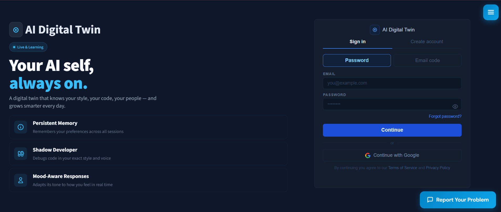
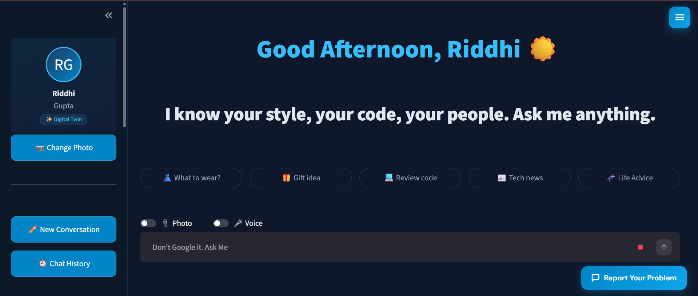
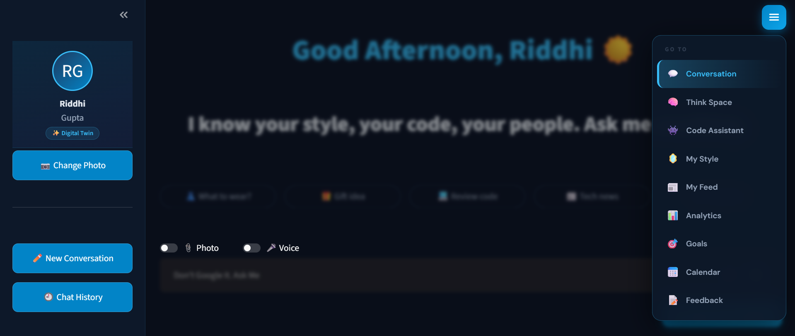
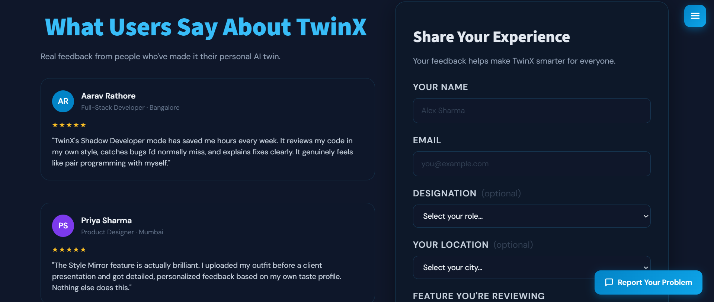

<div align="center">


<br/><br/>


# TwinX — AI Digital Twin

### *Your AI self, always on.*

> A digital twin that knows your style, your code, your people — and grows smarter every day.

<br/>

---

</div>

## 📸 Screenshots

<br/>

| Landing & Auth | Dashboard |
|:-:|:-:|
|  |  |

| Mood Detector & Navigation | Feedback & Reviews |
|:-:|:-:|
|  |  |

<br/>

---

## 🧬 What is TwinX?

**TwinX** is a personalized AI Digital Twin web application that learns who you are — your preferences, your coding style, your people — and becomes a smarter, more personal version of an AI assistant over time.

Unlike generic AI chatbots, TwinX is *yours*. It remembers context across sessions, adapts its tone to your mood, and reasons about your life — not just your prompts.

<br/>

---

## ✨ Core Features

| Feature | Description |
|---|---|
| 💬 **Conversation** | A private journaling and brainstorming space powered by your AI twin |
| 🧠 **Think Space** | Remembers your preferences, conversations, and context across all sessions using RAG + ChromaDB |
| 👾 **Code Assistant** | Debugs, reviews, and writes code in your exact coding style and voice |
| 😊 **Mood-Aware Responses** | Detects your mood via webcam and adapts its tone in real time |
| 🎙️ **Voice Response** | Speaks back to you using text-to-speech with a configurable personality |
| 🎨 **My Style** | Upload outfits, get personalized style feedback based on your taste profile |
| 📰 **My Feed** | Curated tech news and content filtered to your interests |
| 📅 **Calendar** | Integrated scheduling and planning assistant |
| 🎯 **Goals** | Set, track, and get accountability support for your personal goals |
| 📊 **Analytics** | Insights into your usage, mood patterns, and conversation history |


<br/>

---

## 🏗️ Tech Stack
```
┌─────────────────────────────────────────────────────────────┐
│                        TwinX Architecture                   │
├──────────────┬──────────────────────┬───────────────────────┤
│   Frontend   │       Backend        │      AI / Storage     │
├──────────────┼──────────────────────┼───────────────────────┤
│  Streamlit   │  FastAPI (Python)    │  Google Gemini API    │
│  HTML/CSS/JS │  REST API endpoints  │  ChromaDB (RAG/VDB)   │
│  Custom UI   │  JWT Authentication  │  MongoDB Atlas        │
│              │  Gmail SMTP (OTP)    │  Persistent Memory    │
└──────────────┴──────────────────────┴───────────────────────┘
```

### Frontend
- **Streamlit** — Main UI framework with custom CSS overrides
- **JavaScript DOM Manipulation** — Floating hamburger nav, tab switching, dynamic rendering
- **ScrollReveal / Typed.js** — UI animations and typewriter effects

### Backend
- **FastAPI** — High-performance Python REST API
- **JWT** — Secure token-based authentication
- **Gmail SMTP** — OTP-based email verification flow

### AI & Storage
- **Google Gemini API** — Core LLM powering conversation, code review, mood adaptation
- **ChromaDB** — Vector database for Retrieval-Augmented Generation (RAG)
- **MongoDB Atlas** — Persistent user data, conversation history, preferences

### Deployment
- **Render.com** — Backend (FastAPI) hosting
- **Streamlit Cloud** — Frontend hosting
- **MongoDB Atlas** — Cloud database

<br/>

---

## 🚀 Getting Started

### Prerequisites
```bash
Python 3.10+
MongoDB Atlas account
Google Gemini API key
Gmail account (for OTP SMTP)
```

### 1. Clone the Repository
```bash
git clone https://github.com/YOUR_USERNAME/twinx.git
cd twinx
```

### 2. Set Up the Backend
```bash
cd backend
pip install -r requirements.txt
```

Create a `.env` file in `/backend`:
```env
MONGO_URI=your_mongodb_atlas_connection_string
GEMINI_API_KEY=your_gemini_api_key
JWT_SECRET=your_jwt_secret_key
EMAIL_ADDRESS=your_gmail_address
EMAIL_PASSWORD=your_gmail_app_password
```

Run the FastAPI server:
```bash
uvicorn main:app --reload
```

### 3. Set Up the Frontend
```bash
cd frontend
pip install -r requirements.txt
streamlit run app.py
```

### 4. Environment Variables (Frontend)
```env
BACKEND_URL=http://localhost:8000
```

<br/>

---

## 📁 Project Structure
```
twinx/
├── backend/
│   ├── main.py               # FastAPI entry point
│   ├── routes/               # API route handlers
│   │   ├── auth.py           # Login, register, OTP
│   │   ├── chat.py           # Conversation endpoints
│   │   ├── memory.py         # ChromaDB RAG operations
│   │   └── user.py           # Profile, style, goals
│   ├── models/               # MongoDB models
│   ├── services/             # Gemini API, email, voice
│   └── requirements.txt
│
├── frontend/
│   ├── app.py                # Streamlit main app
│   ├── pages/                # Multi-page Streamlit app
│   │   ├── dashboard.py
│   │   ├── code_assistant.py
│   │   ├── my_style.py
│   │   ├── analytics.py
│   │   └── feedback.py
│   ├── components/           # Reusable UI components
│   ├── static/               # Custom CSS, JS
│   └── requirements.txt
│
├── screenshots/              # App screenshots for README
├── .gitignore
├── LICENSE
└── README.md
```

<br/>

---

## 🔐 Authentication Flow
```
User visits TwinX
       │
       ▼
  Sign In / Register
       │
  ┌────┴────┐
  │Password │  or  Email OTP (Gmail SMTP)
  └────┬────┘
       │
  JWT Token issued
       │
       ▼
  Dashboard unlocked
  (Session persists via MongoDB)
```

<br/>

---

## 🧠 How RAG Memory Works

TwinX uses **Retrieval-Augmented Generation** to give the AI twin long-term memory:

1. Every user conversation is **chunked and embedded**
2. Embeddings are stored in **ChromaDB** (local vector database)
3. On each new message, **relevant memories are retrieved** via similarity search
4. Retrieved context is injected into the **Gemini API prompt**
5. The AI responds with personalized, context-aware answers

This means your twin genuinely *remembers* things you've told it — your project names, your preferences, your people.

<br/>

---

## 🤝 Contributing

Contributions, issues, and feature requests are welcome!

1. Fork the repository
2. Create your feature branch: `git checkout -b feature/amazing-feature`
3. Commit your changes: `git commit -m 'Add amazing feature'`
4. Push to the branch: `git push origin feature/amazing-feature`
5. Open a Pull Request

Please make sure to update tests as appropriate and follow the existing code style.

<br/>

---

## 👨‍💻 Contributors

<table>
  <tr>
    <td align="center">
      <a href="https://github.com/NirmitPrasad">
        <br />
        <sub><b>Nirmit Prasad</b></sub>
      </a><br />
      <sub>🏗️ AI & Backend Developer</sub>
    </td>
    <td align="center">
      <a href="https://github.com/RiddhiKumari04">
        <br />
        <sub><b>Riddhi Kumari</b></sub>
      </a><br />
      <sub>💻 Software Developer</sub>
    </td>
    <td align="center">
      <a href="https://github.com/294Priyanshu">
        <br />
        <sub><b>Priyanshu Gupta</b></sub>
      </a><br />
      <sub>🤖 DevOps Developer</sub>
    </td>
  </tr>
</table>

<br/>

---

## 📄 License

This project is licensed under the **MIT License** — see the [LICENSE](./LICENSE) file for details.

<br/>

---

## 🙏 Acknowledgements

- [Google Gemini API](https://ai.google.dev/) — Core AI engine
- [ChromaDB](https://www.trychroma.com/) — Vector database for persistent memory
- [FastAPI](https://fastapi.tiangolo.com/) — Backend framework
- [Streamlit](https://streamlit.io/) — Frontend UI framework
- [MongoDB Atlas](https://www.mongodb.com/atlas) — Cloud database

<br/>

---

<div align="center">

*"Don't Google it. Ask Me."*

⭐ If you found TwinX useful, please consider giving it a star!

</div>
